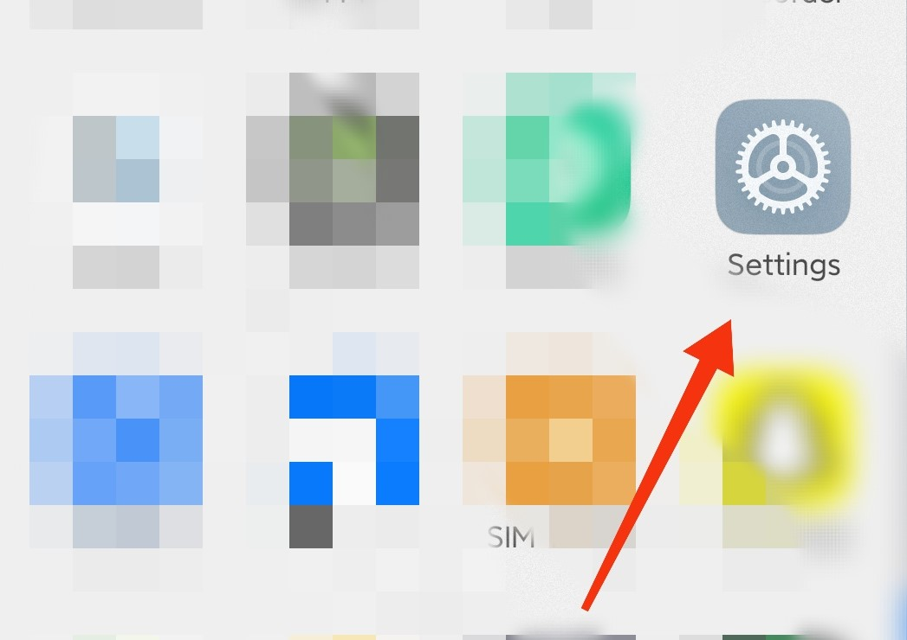
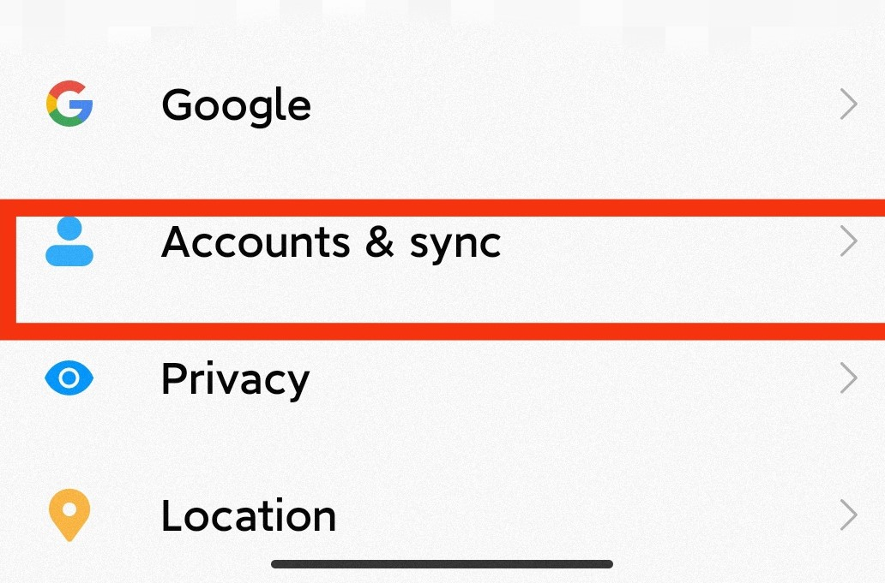
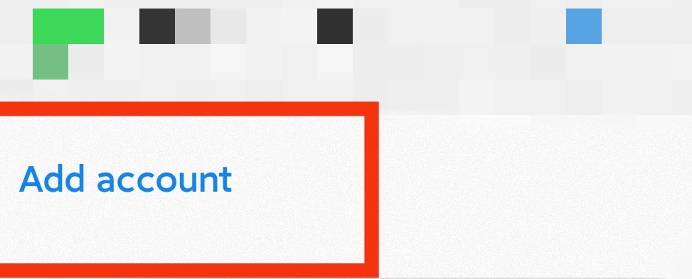
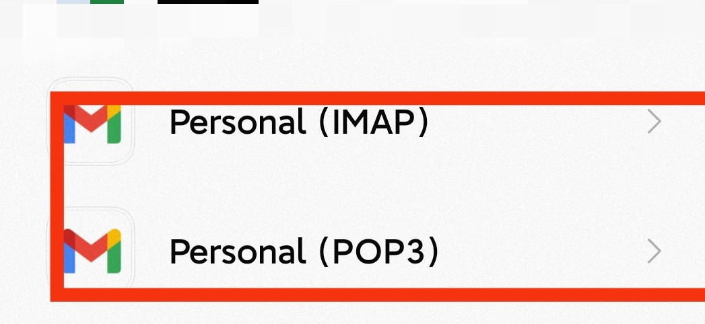
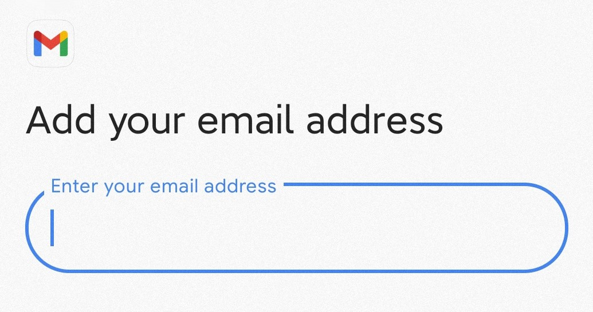
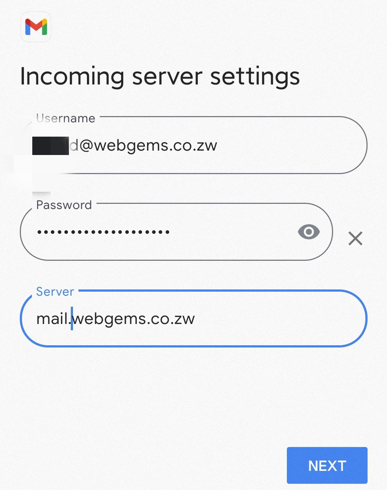
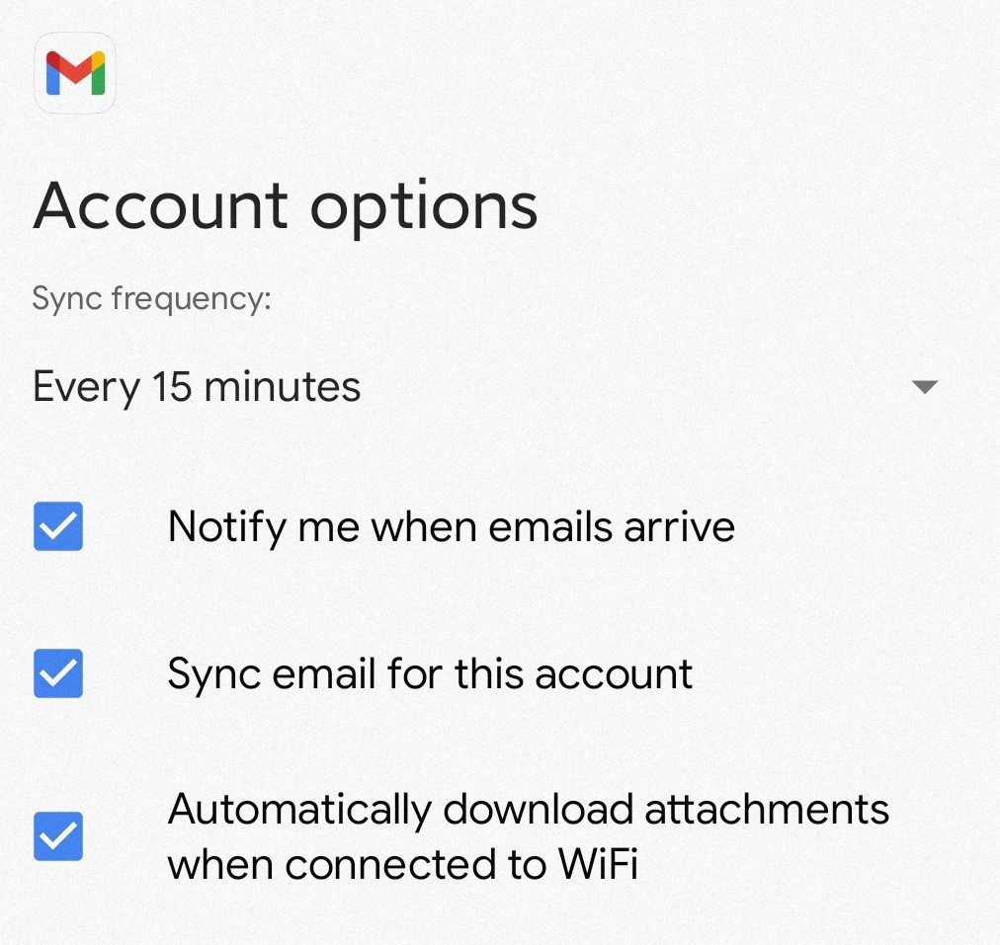
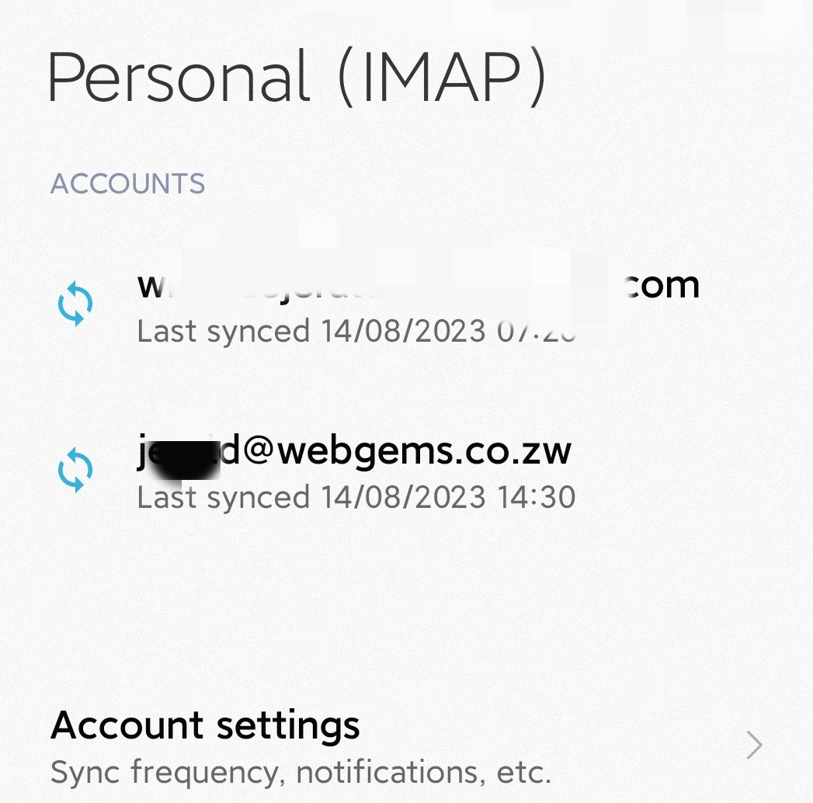

### Setting up email account on mobile phone

---

1. On your android device, go to the home screen and tap on the **Settings** app.
   

   
2. Scroll down and tap on the "**Accounts**" or "**Accounts and Sync**" depending on the android version you have
   

   
3. Tap on "**Add account**" or **+** symbol to begin adding a new account 

   
4. And select the **Personal (IMAP/POP)** or **Other**

   
5. Enter your email address and password in the appropriate fields 

   
6. Enter the following details in corresponding fields of the Incoming server settings and click next
   
    **Username**: your full email address

    **Password**: your password for this email account

    **Server**: mail.webgems.co.zw

7. On the Account options screen check the options
   Notify me when emails arrive
   Sync email for this account
       

**8**. Finally tap on **Next** or **Finish** to complete the setup process, your email account should now be set up on your android device, and you should start receiving emails to your inbox

