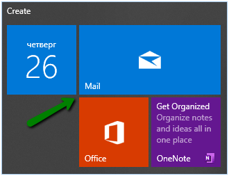
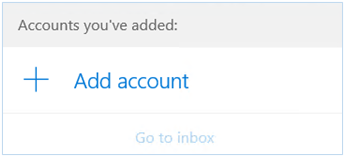
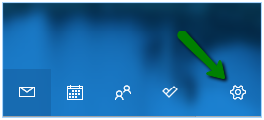
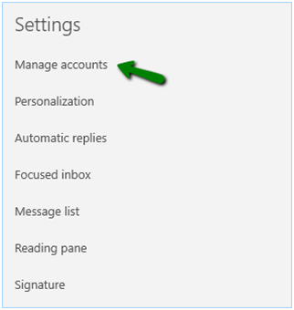
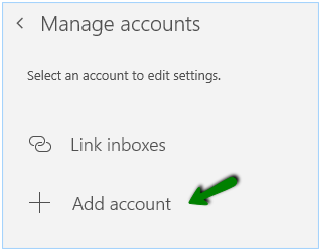
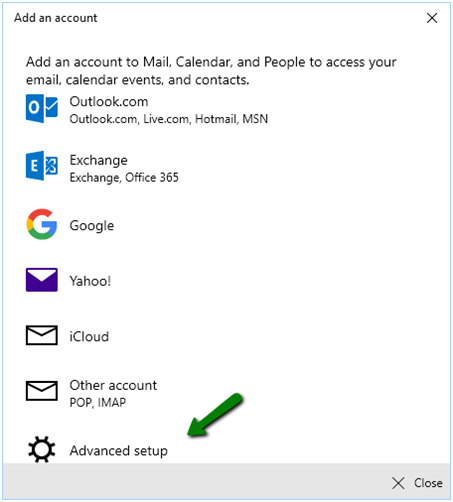
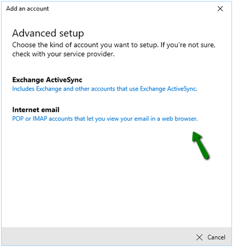

## How to configure webgems email on windows desktop 

---
In this tutorial, you will find a handy guide on how to set up a cPanel Email account in the Windows 10 default mail application.
Throughout the guide, we will reference a test email account: example@webgems.co.zw
### Setting up email account on windows desktop

to setup your account

1. Click on the Windows Start menu and choose the Mail app on the Start Screen:

**PLEASE NOTE:** The Start Screen may look different on your side and Mail app might be missing. Therefore, feel free to use Search charm to find the app

If this is the first time you've opened the Windows Mail app, you’ll see a Welcome page.

1.  Select **Add account** to get started:

If you've used the Mail app before, at the bottom of the left navigation pane, select Settings:

Now choose **Manage Accounts**:

After you’ve done this, select **Add account**:

3. Scroll down to view all options and select **Advanced setup**: 

4. Now click **Internet Email**:

5. Enter the following details in corresponding fields of the Advanced setup window:

**Email address**: your full email address

**Username**: your full email address

**Password**: your password for this email account

**Account name**: the name that you'll see in the left navigation pane of Mail for Windows 10, as well as in the Manage Accounts navigation pane (you can choose any name you want).

**Send your messages using this name**: the name you want your recipients to see when they receive your message (this name will be displayed in the From field of sent emails)

**Incoming (IMAP) email server**: the server your account is hosted on

**Account type**: IMAP4 or POP3

**Outgoing (SMTP) email server**: the server your account is hosted on

****

Also, make sure that the following options are marked:

- Outgoing server requires authentication
- Use the same username and password for sending email
- Require SSL for incoming email
- Require SSL for outgoing email

After you've entered the required information, click Sign in >>  Done

Congrats! You’ve now set up your cPanel email account on Windows 10.