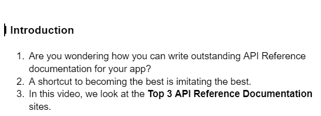
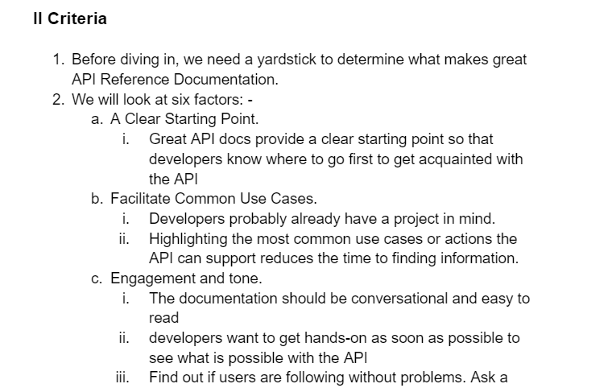

## A guide on how to write a video outline

---

1. **Introducing the topic:**

The first step in writing a video outline is to introduce the topic. This means clearly stating what the video will be about and giving the viewers a brief overview of the subject matter. The introduction should be concise yet engaging, capturing the audience's attention and setting the stage for the rest of the content.

2. **Brainstorm the main points:**

After introducing the topic, the next step is to brainstorm the main points that you want to cover in the video. Take some time to think about the key ideas, concepts, or steps that you want your audience to understand or follow. Brainstorming allows you to generate a list of potential points that can be expanded upon later.

3. **Organize the points.**

Once you have a list of potential main points, it's important to organize them in a logical order. Consider the flow of information and how one point naturally leads to the next. This helps in creating a structured and coherent video outline. You may choose to arrange the points chronologically, by importance, or based on any other relevant criteria that suits the topic.

4. **Add details:**

With the main points in place, it's time to add more details to each one. This involves thinking about the specific information that you want to share for each point. Consider any supporting evidence, examples, or explanations that will help enhance the viewer's understanding of the topic. Elaborating on the details ensures that your video outline is comprehensive and provides valuable information to the audience.

5. **Referencing the sources of your research**

When writing a video outline, it's important to include references to the sources of your research. This helps to support the credibility and accuracy of the information you present. The IEEE (Institute of Electrical and Electronics Engineers) referencing style is commonly used in technical fields. Ensure that you accurately cite your sources according to the IEEE guidelines, including information such as author names, publication titles, sources, and publication years.

6. **Format of the document**

Maintaining a consistent and professional format is crucial when creating a video outline. Specify the formatting details to ensure a visually appealing and easy-to-read document. In this case, the suggested font for the outline is Arial. For the main headings, set the font size to 16 px, and for the supporting text or subheadings, use a font size of 14 px. Consistency in font type and size throughout the outline helps convey a polished and cohesive presentation.

