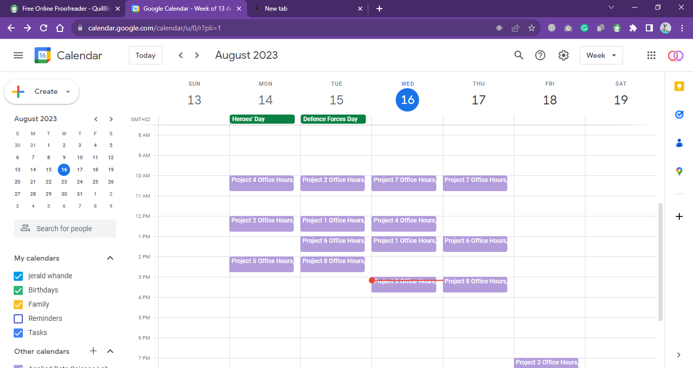
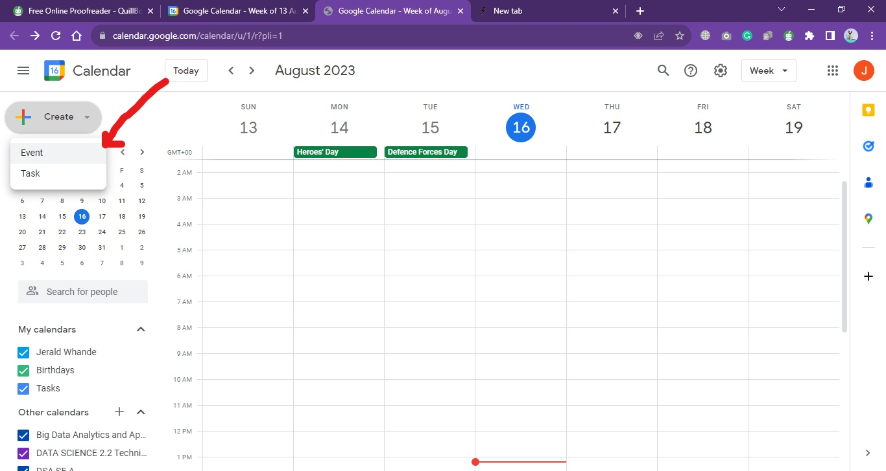
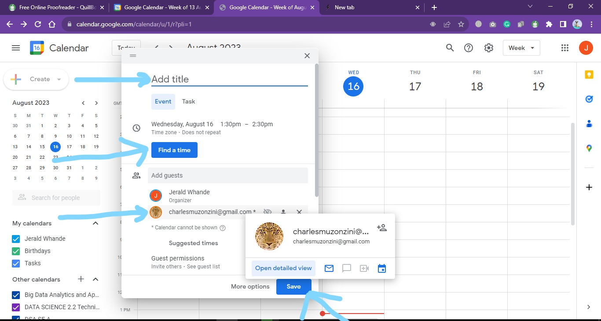
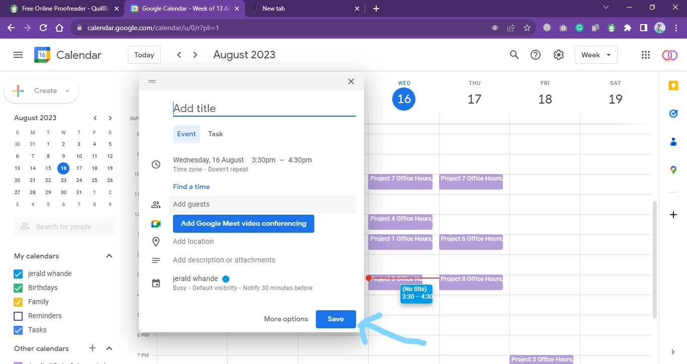

## Steps to take when applying for a leave

---

1. Open your **web browser** and go to **calendar.google.com**. And sign in using your Google account details.
   

1. After **signing in**, you will see the Calendar interface. You should look for a **+** button or a **Create button**, typically located at the top left corner of the screen. Click on that button to create a new event.

3. A pop-up window will appear, asking them to fill in the event details. They should enter a **title** for the leave request, for example, "Going to see supervisor."

4. And select the **starting and ending dates** for your leave by clicking on the calendar widget. You can also set the duration if it spans multiple days.

5. In the "**Add Guests**" or "**Invited People**" field, you should enter **Charles gmail address** so that he will be notified about your leave request.

6. If there are specific details about your leave that you need to provide, such as the reason or any additional notes, you can enter them in the Description box.

7. After filling in all the details, click on the **Save** button. This will save the leave request on your calendar and send the invitations to the listed guests.

